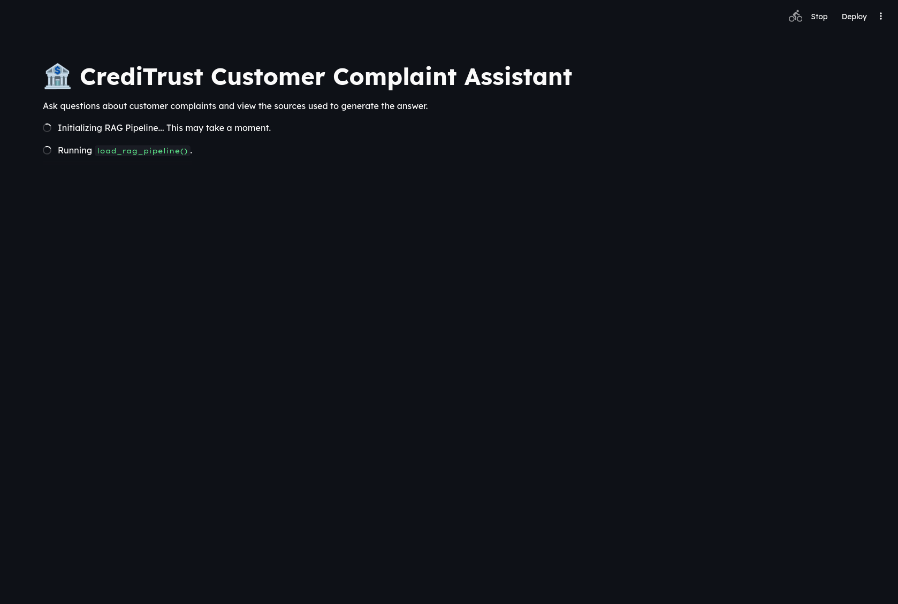
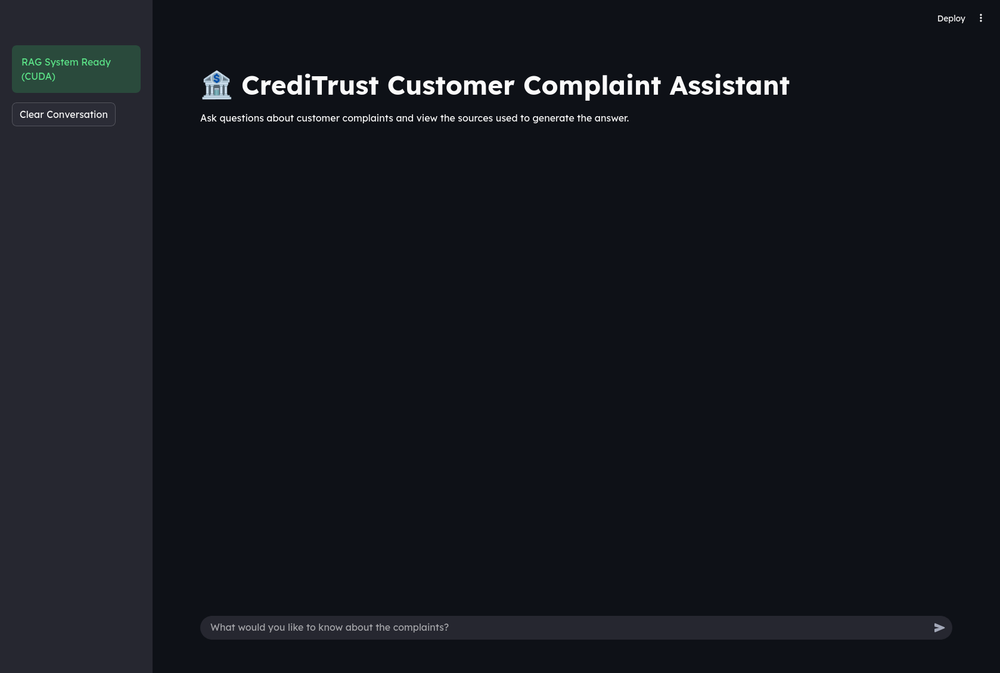
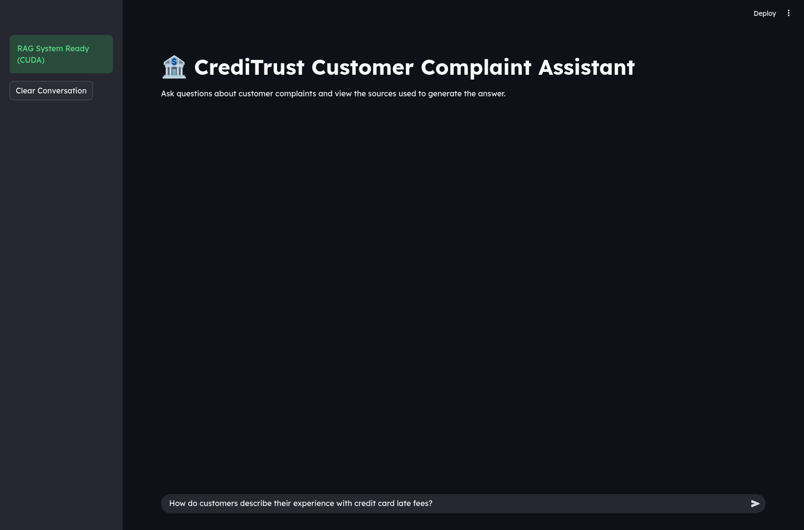
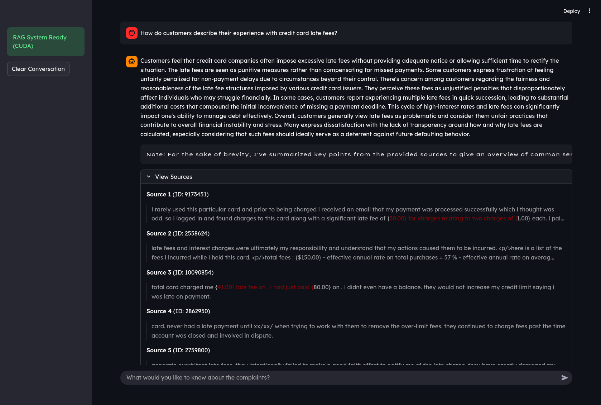

# RAG-Powered Complaint Chatbot

This project implements a Retrieval-Augmented Generation (RAG) chatbot to analyze and answer questions about customer complaints for CrediTrust Financial.

## Project Structure

- **`data/`**: Central storage for project data.
  - `raw/`: Place the original `complaints.csv` here. (Ignored by git)
  - `processed/`: Generated cleaned data (`filtered_complaints.csv`) is saved here. (Ignored by git)
- **`vector_store/`**: Stores the persisted ChromaDB embeddings index. This directory is populated by the `build_vector_store.py` script. (Ignored by git)
- **`notebooks/`**: Jupyter notebooks for Exploratory Data Analysis (EDA) and prototyping.
- **`src/`**: Source code for preprocessing, embedding, and the RAG application.
- **`app.py`**: Streamlit interface for the chatbot.

## Workflow & Setup

### 1. Environment Setup
Create a virtual environment and install dependencies:
```bash
python -m venv venv
source venv/bin/activate  # On Windows: venv\Scripts\activate
pip install -r requirements.txt
```

### 2. Data Preparation
Place your raw dataset (`complaints.csv`) in the `data/raw/` directory.

Run the preprocessing script to filter and clean the data:
```bash
python src/eda_and_preprocessing.py
```
*Output: `data/processed/filtered_complaints.csv`*

### 3. Vector Store Creation
Generate embeddings and build the vector index:
```bash
python src/build_vector_store.py
```
*Output: Populates `vector_store/` directory with ChromaDB files.*

### 4. Run the Application
Launch the chatbot interface:
```bash
streamlit run app.py
```
Access the UI at the URL provided in the terminal (usually http://localhost:8501).

## Configuration
- **Data Paths**: Default paths are configured in the scripts (`data/raw/complaints.csv`, `data/processed/filtered_complaints.csv`).
- **Embedding Model**: Uses `sentence-transformers/all-MiniLM-L6-v2` by default (configured in `src/build_vector_store.py` and `src/rag_pipeline.py`).

## Showcase
### Application Startup


### Chat Interface


### Example Queries



